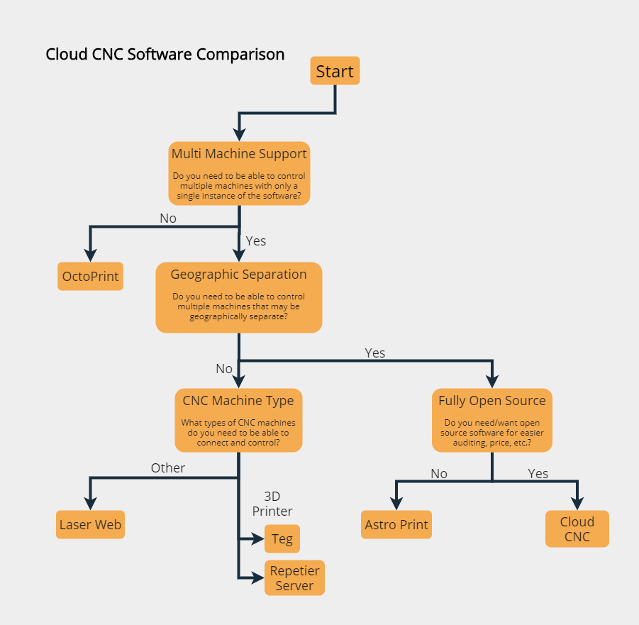

# Software Comparison

## Flowchart

## [Astro Print](https://astroprint.com)
Astro Print is similar to Cloud CNC in many ways, but one important distinction is that Astro Print is commercial software and Cloud CNC always has been (and always will be) free and open source. The upside of Astro Print is superior support, better compatibility, etc. however this all comes at a literal cost. The upsides to Cloud CNC are everything good about open source software and of course its price: nothing.

TL;DR: If you need enterprise support, go with Astro Print; if you need/want free software, easier auditing, etc. go with Cloud CNC.

## [OctoPrint](https://octoprint.org)
OctoPrint is excellent for people with only 1 or 2 3D printers and don't mind synchronizing things between multiple instances of it in order to control multiple printers. It has excellent community support and a wide range of plugins unlike Cloud CNC. OctoPrint focuses on individual printers while Cloud CNC focuses on many CNC machines (not necessarily 3D printers) that may be geographically distributed while still allowing users to connect through the same interface.

TL;DR: OctoPrint is better suited for users with few printers while Cloud CNC is better suited for larger operations.

## [Teg](https://tegh.io)
Teg is quite possibly the most similar to Cloud CNC of any software on this list; nevertheless Teg offers many features such as being open source, multi-printer support, a modern interface, and more. The major difference between Teg and Cloud CNC is the architecture; Teg runs on a single computer and can connect to multiple printers and while Cloud CNC can run from a single computer, it can really stretch its legs when running on 3 or more computers (1 core, 2 controllers).

TL;DR: Teg offers similar features to Cloud CNC; Teg is best suited for multiple 3D printers in close proximity while Cloud CNC is better for geographically separated printers.

## [Laser Web](https://laserweb.yurl.ch)
Laser Web is obviously not aimed at 3D printers, but instead laser cutters. Cloud CNC chooses not to specifically support any 1 type of CNC machine which has its upsides: it works with a lot of different types of machines and its downsides too: the compatibility and support is quite shallow.

TL;DR: Use Laser Web if you only plan on remotely controlling laser cutters and CNC mills, not 3D printers.

## [Repetier Server](https://www.repetier-server.com)
Repetier Server supports multiple 3D printers, but like OctoPrint and Teg, the printer(s) must be in close geographic proximity in order to work. Repetier Server is also quite mature compared to the rest of the software (including Cloud CNC) in this comparison.

TL;DR: Use Repetier if you want mature software and your 3D printers are geographically close together otherwise use Cloud CNC.