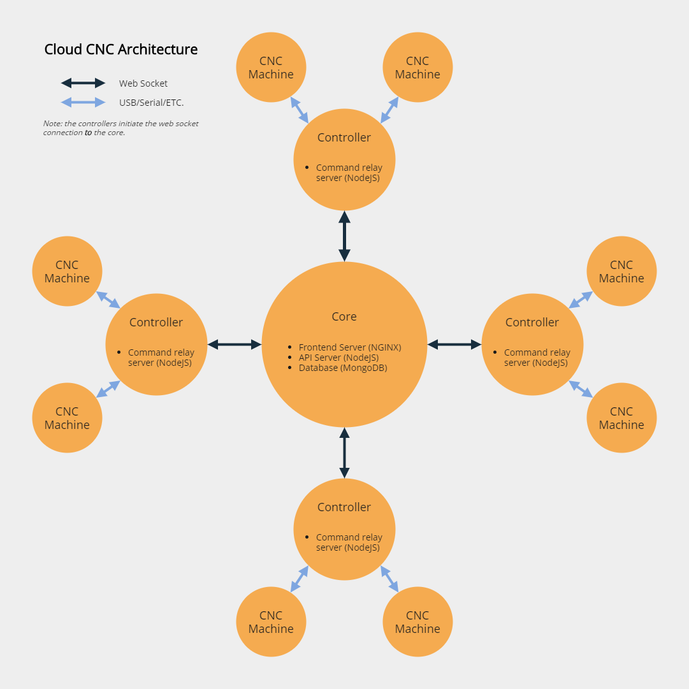

# Introduction

## Architecture

Cloud CNC consists of 3 different components
* Frontend
* Core
* Controller

## Frontend
The frontend uses the [Vue](https://vuejs.org) UI framework based and the [Vuetify](https://vuetifyjs.com) UI system. It uses [Vue CLI](https://cli.vuejs.org) to manage builds. The frontend connects to the core via the [HTTP API](./http-api).

The repository is located at [github.com/cloud-cnc/frontend](https://github.com/cloud-cnc/frontend).

## Core
The core *glues* the frontend and controller(s) together. It uses [Express](https://expressjs.com) for HTTP routing and [Mongo](https://mongodb.com) for a database. The core is both a raw HTTP and a websocket server.

The repository is located at [github.com/cloud-cnc/core](https://github.com/cloud-cnc/core).

::: tip
The core does need to be port forwarded in order for the frontend to make HTTP requests to it and for the controller(s) to initiate web socket sessions.
:::

## Controller
The controller is meant to run on a small computer such as a [Raspberry Pi](https://raspberrypi.org/) and directly connects to your CNC machines typically over a USB or serial connection. The controller connects to the core via a [Websocket API](./websocket-api).

The repository is located at [github.com/cloud-cnc/controller](https://github.com/cloud-cnc/controller).

::: tip
Because the controller(s) connect **to** the core, they typically only need an internet connection, you don't need to port forward them.
:::